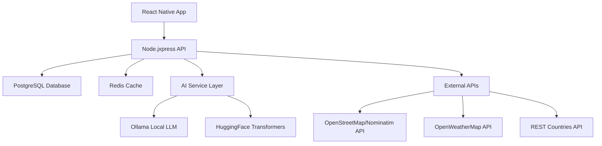

# Design Document - TravelJoy AI Travel Planner

## Overview

TravelJoy is a React Native mobile application that leverages AI to create personalized travel itineraries. The app follows a client-server architecture with a React Native frontend, Node.js/Express backend, PostgreSQL database, and integrates multiple external APIs for comprehensive travel planning.

## Architecture

### High-Level Architecture



### Architecture Pattern

- **Client-Server**: RESTful API communication between mobile app and backend
- **Modular Microservice**: Backend organized into distinct service modules
- **Monorepo**: Single codebase for React Native app with shared components

### Technology Stack

- **Frontend**: React Native with Expo, TypeScript
- **Backend**: Node.js with Express/NestJS
- **Database**: PostgreSQL with Prisma ORM
- **Caching**: Redis for API response caching
- **Authentication**: JWT with email/password
- **AI Integration**: Ollama (local LLM) or HuggingFace Transformers (free tier)
- **External APIs**: OpenStreetMap/Nominatim (free), OpenWeatherMap (free tier), REST Countries API
- **Payment**: Stripe for subscription management

## Components and Interfaces

### Frontend Components

#### Core Screens

1. **AuthenticationScreen**

   - Login/Register forms
   - Password reset functionality
   - Biometric authentication support

2. **TripCreationScreen**

   - Destination input with autocomplete
   - Budget slider and date picker
   - Preferences selection (activity type, food, transport)
   - Form validation and submission

3. **TripPlanScreen**

   - Daily itinerary display
   - Interactive map integration
   - Edit/replace activity functionality
   - Weather information overlay

4. **ChatAssistantScreen**

   - Real-time chat interface
   - Quick action buttons
   - Context-aware suggestions
   - Voice input support

5. **ProfileScreen**

   - User account management
   - Travel preferences settings
   - Trip history and favorites

6. **SubscriptionScreen**
   - Subscription plan selection
   - Payment processing with Stripe
   - Subscription status and billing history
   - Free trial management

#### Shared Components

- **MapComponent**: OpenStreetMap integration with custom markers using react-native-maps
- **WeatherWidget**: Current and forecast weather display
- **ActivityCard**: Reusable component for displaying activities
- **LoadingSpinner**: AI processing indicator
- **ErrorBoundary**: Graceful error handling
- **SubscriptionGate**: Component to check subscription status and redirect to payment

### Backend Services

#### Authentication Service

```typescript
interface AuthService {
  register(email: string, password: string): Promise<User>;
  login(email: string, password: string): Promise<AuthToken>;
  resetPassword(email: string): Promise<void>;
  validateToken(token: string): Promise<User>;
}
```

#### Trip Service

```typescript
interface TripService {
  createTrip(tripData: TripInput): Promise<Trip>;
  generateItinerary(tripId: string): Promise<Itinerary>;
  updateActivity(
    activityId: string,
    updates: ActivityUpdate
  ): Promise<Activity>;
  getTripById(tripId: string): Promise<Trip>;
}
```

#### AI Service

```typescript
interface AIService {
  generateItinerary(preferences: TravelPreferences): Promise<DailyPlan[]>;
  processChat(message: string, context: ChatContext): Promise<ChatResponse>;
  optimizePlan(
    plan: DailyPlan[],
    constraints: Constraints
  ): Promise<DailyPlan[]>;
}
```

#### External API Service

```typescript
interface ExternalAPIService {
  searchPlaces(query: string, location: Coordinates): Promise<Place[]>;
  getWeather(location: Coordinates, dates: DateRange): Promise<WeatherData>;
  getCountryInfo(countryCode: string): Promise<CountryInfo>;
}
```

#### Subscription Service

```typescript
interface SubscriptionService {
  createSubscription(userId: string, planId: string): Promise<Subscription>;
  cancelSubscription(subscriptionId: string): Promise<void>;
  checkSubscriptionStatus(userId: string): Promise<SubscriptionStatus>;
  processPayment(paymentData: PaymentData): Promise<PaymentResult>;
  handleWebhook(webhookData: StripeWebhook): Promise<void>;
}
```

## Data Models

### User Model

```typescript
interface User {
  id: string;
  email: string;
  passwordHash: string;
  profile: UserProfile;
  subscription?: Subscription;
  tripsThisMonth: number;
  createdAt: Date;
  updatedAt: Date;
}

interface UserProfile {
  firstName?: string;
  lastName?: string;
  preferences: TravelPreferences;
}
```

### Trip Model

```typescript
interface Trip {
  id: string;
  userId: string;
  destination: string;
  budget: number;
  startDate: Date;
  endDate: Date;
  preferences: TravelPreferences;
  itinerary: DailyPlan[];
  status: TripStatus;
  createdAt: Date;
}

interface DailyPlan {
  date: Date;
  activities: Activity[];
  meals: Meal[];
  transportation: Transportation[];
  estimatedCost: number;
}
```

### Activity Model

```typescript
interface Activity {
  id: string;
  name: string;
  description: string;
  location: Coordinates;
  duration: number;
  cost: number;
  category: ActivityCategory;
  openingHours: OpeningHours;
  rating: number;
  imageUrl?: string;
}
```

### Subscription Model

```typescript
interface Subscription {
  id: string;
  userId: string;
  planId: string;
  status: SubscriptionStatus;
  currentPeriodStart: Date;
  currentPeriodEnd: Date;
  cancelAtPeriodEnd: boolean;
  stripeSubscriptionId: string;
  createdAt: Date;
  updatedAt: Date;
}

interface SubscriptionPlan {
  id: string;
  name: string;
  description: string;
  price: number;
  currency: string;
  interval: "month" | "year";
  features: string[];
  maxTripsPerMonth: number;
  stripePriceId: string;
}

enum SubscriptionStatus {
  ACTIVE = "active",
  CANCELED = "canceled",
  PAST_DUE = "past_due",
  UNPAID = "unpaid",
  TRIALING = "trialing",
}
```

## Error Handling

### Frontend Error Handling

- **Network Errors**: Retry mechanism with exponential backoff
- **Validation Errors**: Real-time form validation with user-friendly messages
- **API Errors**: Graceful degradation with cached data when available
- **Crash Recovery**: Error boundaries to prevent app crashes

### Backend Error Handling

- **API Rate Limits**: Implement caching and request queuing
- **External API Failures**: Fallback to cached data or alternative providers
- **Database Errors**: Connection pooling and retry logic
- **AI Service Errors**: Timeout handling and fallback responses

### Error Response Format

```typescript
interface ErrorResponse {
  error: {
    code: string;
    message: string;
    details?: any;
  };
  timestamp: string;
  requestId: string;
}
```

## Testing Strategy

### Frontend Testing

- **Unit Tests**: Component logic and utility functions using Jest
- **Integration Tests**: Screen navigation and API integration using Detox
- **E2E Tests**: Critical user flows on both iOS and Android simulators
- **Performance Tests**: Memory usage and rendering performance

### Backend Testing

- **Unit Tests**: Service layer logic and utility functions
- **Integration Tests**: API endpoints and database operations
- **Load Tests**: API performance under concurrent requests
- **Security Tests**: Authentication and data validation

### AI Testing

- **Response Quality**: Validate AI-generated itineraries against criteria
- **Performance Tests**: Response time and token usage optimization
- **Fallback Tests**: Behavior when AI services are unavailable

## Performance Optimization

### Frontend Optimization

- **Code Splitting**: Lazy loading of screens and components
- **Image Optimization**: Compressed images with lazy loading
- **State Management**: Efficient Redux/Context usage
- **Caching**: Local storage for offline functionality

### Backend Optimization

- **Database Indexing**: Optimized queries for user and trip data
- **API Caching**: Redis caching for external API responses
- **Connection Pooling**: Efficient database connection management
- **Rate Limiting**: Prevent API abuse and ensure fair usage

### AI Optimization

- **Prompt Engineering**: Optimized prompts for faster, better responses
- **Response Caching**: Cache similar itinerary requests
- **Batch Processing**: Group multiple AI requests when possible
- **Token Management**: Efficient token usage to minimize costs

## Security Considerations

### Authentication Security

- **Password Hashing**: bcrypt with salt for password storage
- **JWT Security**: Short-lived access tokens with refresh tokens
- **Session Management**: Secure token storage and automatic expiration

### Data Security

- **Encryption**: AES-256 encryption for sensitive data at rest
- **HTTPS**: All API communications over secure connections
- **Input Validation**: Comprehensive validation and sanitization
- **SQL Injection Prevention**: Parameterized queries and ORM usage

### Privacy Protection

- **Data Minimization**: Collect only necessary user information
- **Consent Management**: Clear privacy policy and user consent
- **Data Deletion**: User-initiated account and data deletion
- **Third-party APIs**: Minimize data sharing with external services

## Subscription and Payment Flow

### Subscription Plans

- **Free Trial**: 7-day trial with 1 trip generation
- **Basic Plan**: $9.99/month - 5 trips per month
- **Premium Plan**: $19.99/month - Unlimited trips + priority AI processing

### Payment Integration

- **Stripe Integration**: Secure payment processing
- **Webhook Handling**: Real-time subscription status updates
- **Trial Management**: Automatic conversion from trial to paid
- **Cancellation Flow**: User-initiated subscription cancellation

### Access Control

- **Subscription Gates**: Check subscription status before trip creation
- **Usage Limits**: Track and enforce monthly trip limits
- **Grace Period**: 3-day grace period for failed payments

## Free API Integrations

### OpenStreetMap/Nominatim API

- **Usage**: Free geocoding and place search
- **Rate Limits**: 1 request per second
- **Features**: Address lookup, reverse geocoding, place details

### OpenWeatherMap API (Free Tier)

- **Usage**: Weather data and forecasts
- **Rate Limits**: 1,000 calls/day, 60 calls/minute
- **Features**: Current weather, 5-day forecast, weather alerts

### REST Countries API

- **Usage**: Country information and travel data
- **Rate Limits**: No rate limits (completely free)
- **Features**: Country details, currencies, languages, time zones

### HuggingFace Transformers (Free Tier)

- **Usage**: AI text generation for travel planning
- **Rate Limits**: 30,000 characters/month free
- **Features**: Travel itinerary generation, chat responses

### Ollama (Local LLM)

- **Usage**: Self-hosted AI model for unlimited usage
- **Requirements**: Server with sufficient RAM (8GB+ recommended)
- **Features**: Complete privacy, no API costs, customizable models

## Deployment Strategy

### Development Environment

- **Local Development**: Expo development server for React Native
- **Backend Development**: Docker containers for consistent environment
- **Database**: Local PostgreSQL instance or Docker container

### Production Deployment

- **Mobile App**: App Store and Google Play Store distribution
- **Backend**: Cloud hosting (Render/Fly.io) with Node.js support
- **Database**: Managed PostgreSQL instance (15+)
- **Caching**: Redis cache instance
- **Monitoring**: Application performance and error tracking
